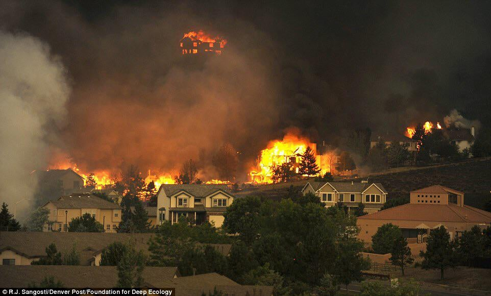

<style type="text/css">
  body{
  font-size: 13pt;
}
</style>

```{r setup, include=FALSE}
knitr::opts_chunk$set(echo = TRUE)
library(prettydoc)
library(tidyverse)
```

## Overview

Climate change is one of the hardest pressing issues that modern society faces. From the advent of transport automation via coal to increased industrial wastage, the environment that we know is slowly becoming perilous. The impact of climate change is real and is already having a significant impact on our ecosystems, economies, and our communities. This project hopes to showcase how, as global citizens, we got here coupled with understanding the causations and future ramifications of global warming.

Since we are all from disparate places, we wish to use this data to explore environmental impacts in different regions. From the raging wildfires of Brian and Swami’s home state of California to the eroding shoreline of Anam’s home state of Florida, we have all seen the consequences of climate change. 

We will explore climate change and its influence on different aspects of society. In the end, we are hoping to compare the different regions and highlight how they are affected by the ongoing effects of climate change. 

Here are a couple of preliminary questions we have in mind: Do some countries have better climate change policies than others, and is this reflected in the data? Does the type of geography or location have an effect on the amount of warming?

```{r echo=FALSE, out.width = '100%', fig.align='center'}

```

<br />

## The Story

To understand the brutal effects of climate change as well as what people think about climate change in the modern era, you create a time travel machine. The main goal for you (the reader) is to prove to the world that climate change exists and explain to the people before you the effects of modern-day global warming. You do this by calling upon three meteorologists from different eras: 

* Sir John, from the 1700s
* Rachel, from the 1800’s 
* Bill from the 1900’s. 

You want to showcase your findings on how temperatures rise, how countries are effected by these drastic temperature changes, and finally, what holds for the future state of the Earth.

Since Sir John, Rachel, and Bill are all meteorologists, they care deeply about the environment and will be with you every step of the way across the journey of the portfolio. Best of luck and have fun on you tour!

<br />

## Visualizations

### Figure 1 - Interactive World Map 
This visualization will depict temperatures across countries with color intensity indicating higher temperatures. The map is animated and features an interactive slider, allowing for the temporal component to be displayed so we can easily see changes over time.

<iframe src="Interactive_World_Map/Interactive_World_Map.html" width="950" height="950" data-external=1 style="border:none;">
</iframe>

<br />

This graph was created via plotly in Python, and the data was gathered from Kaggle. Some unique insights gained from this graph is the ability visualize how the globe is slowly getting warmer and compare what portions of the globe are getting warmer than the others. For example, the time travelers can notice that the most prominent color is light red around 1885 and once we get to 2007 a darker red (indicating warmer climate).  We can also notice how some regions are getting warmer than others, such as the Middle East and Norther Africa.

<br />

### Figure 2 - Chord Diagram: Human Population Migration
This interactive chord diagram was made in R using the chorddiagram library. It showcases the number of humans moving from one country to the next (and vice versa) parallelly. What we wanted to notice here is how many people are migrating to and from what countries the most. We wanted to understand and begin to explore how this data will relate to the morality as well as the carbon dioxide emission rates by country. This data was taken from a 2004 dataset on global flow of people from the United Nations.

<iframe src="Chord_Diagram/Chord_Diagram.html" width="900" height="550" data-external=1 style="border:none;">
</iframe>

<br />


To the time travelers and readers, notice that as the years progress, more people will be moving to more prominent first world countries and hence notice changes in carbon dioxide emissions along with moralities within the countries themselves.

<br />

## Looking at the Present to better our Future

### Figure 3 - Mortalities Associated with Air Pollution

The below bubble chart depicts the countries with the highest mortality rates attributable to total air pollution as of 2016. We can view the top 30, top 50, and top 100 countries, and compare total mortality by country for both genders. We can identify outliers as well for example, although the Democratic People's Republic of Korea is on the lower end of mortality for women, it is among the highest countries for mortality among men. And although the US and China are among the world's biggest carbon polluters, they have less deaths per 100,000 individuals. Nigeria and Sierra Leone seem to be the countries in which civilians are facing death at the highest rates. This could be due to lack of medical equipment, doctors, and more. This information could be used to receive future funding for medical supplies and equipment in countries that face high air pollution but do not have the facilities to treat those effected by illness. 

<br />

<iframe src="air_pollution_mortality/bubble_mortality.html" width="900" height="600" data-external=1 style="border:none;">
</iframe>

<br />


### Figure 4 - Mortality by Country

We now take a look at the mortality rates attributable to different kinds of air pollution. According to Climate Trade , the United States, China, and India are among the top carbon polluters in the world. We can visualize how the citizens of these countries are faring in the midst of this heavy air pollution in their home countries. The notable feature here is that we get a side-by-side breakdown of how each of the illnesses below effects each gender:

* COPD - chronic obstructive pulmonary disease

* IHD - ischaemic heart disease

* LRI - Lower Respiratory Infection

* Stroke

* T,B,LC - Trachea, Bronchus, Lung Cancers

<br />

#### Figure 4a - China
<iframe src="air_pollution_mortality/china_mortality_air.html" width="900" height="400" data-external=1 style="border:none;">
</iframe>

We can see that individuals in China mainly suffer from lower respiratory infections, and that stroke is the least prevelant cause of death attributable to air pollution. However, upon further examination, we see that stroke is actually the second highest cause of death attributable to air pollution among men. Thinkng future state, we can use this information to suggest creating more awareness around potentially fatal strokes in men.

<br />

#### Figure 4b - India
<iframe src="air_pollution_mortality/india_mortality_air.html" width="900" height="400" data-external=1 style="border:none;">
</iframe>

We can see that the highest cause of death among both genders in India are Trachea, Bronchus, and Lung Cancers. However upon further examination we see that women in India are suffering from lower respiratory infection at much higher rates than men. The EPA could use this information to ensure that women in countries with high carbon emissions such as India are evaluated regularly for any signs of respiratory infection as well as Trachea, Bronchus, and Lung Cancers.

<br />

#### Figure 4c - US
<iframe src="air_pollution_mortality/us_mortality_air.html" width="900" height="400" data-external=1 style="border:none;">
</iframe>

The US did not report any deaths attributable to household air pollution however again we see that stroke and Trachea, Bronchus, and Lung Cancers are the most prevalant illnesses among those affected by air pollution.

<br />


### Figure 5 - Greenhouse Gas Emissions Over Time & OECD Status

The purpose of this visualization is to investigate whether being a member country of the Organization for Economic Cooperation and Development (OECD) necessarily translates to a greener country with lower greenhouse gas emissions. Over time, more and more countries are recognizing the perks of being an OECD country where countries come together to develop best environmental practices. The graph below will communicate the questions on whether the member countries were able to build a greener economy and whether the non-member countries has significantly produced more greenhouse gas and other toxins over time.
 
<iframe src="OECD_Viz/plotly.html" width="900" height="900" data-external=1 style="border:none;">
</iframe>


<br />


### Figure 6 - Interactive Scatter and Histogram For Various Countries

The interactive scatter and histogram plot was made in Altair via Python. The unique feel of being able to interactive with two different types of plots will serve as a cornerstone in our final portfolio project. This graph was achieved by tidying Berkeley’s climate change data from 1600 - 2000’s across various countries and dates. We were able to populate the 20 countries with the hottest and coolest climates (for the sake of a simple visualization) and allow users to interact with them via the plot. The histogram also juxtaposes different countries and shows how different the temperatures are via dynamic scaling. All of this also includes hovering over scatter points and bar graphs within the histogram. This unique plot aligned with our initial proposal, answering the question we posted on “how different countries temperature trends relate to each other.” 

<iframe src="Scatter_Histogram/Scatter_Histogram.html" width="1000" height="900" data-external=1 style="border:none;">
</iframe>

To the time travelers, this graph shows the viewers a clean and easy way to compare various countries to see how much they differ in terms of their average temperature change in Celsius. This is very useful to the audience, as it gives them a first hand interactive way to see how much countries differ in terms of their change in temperature by region.

<br />

## Innovative View

### Figure 7 - Interactive Globe Map
The globe plot visualization displays the maximum change in temperature in the last three hundred years for over a hundred cities across the globe. The plot was built using threejs, and allows the end-user to swivel, zoom, and pan across the globe at will to investigate the change in temperature by city. The three-dimensional nature of the globe allows the end-user to see the impacts of climate change at the scale they’re most interested in. The globejs function from threejs allows easy, repeatable three-dimensional plotting of any value given that a dataset contains a accompanying latitude, longitude, and value object for the plot they wish to create.
<br>

<iframe src="Globe_Temp/globeplot.html" width="900" height="900" data-external=1 style="border:none;">
</iframe>

<br />

## Looking Towards the Future 

### Figure 8 - Global Total Energy Consumption of Non-Renewable Resources Time Series Graph 

This time series graph showcases the total global energy consumption of non-renewable resources, bisected by areas of the world (Asia, etc.). This graph was made in R using the dygraphs package. The data was gathered from Kaggle and is measured in Terra Watts and Hour. Some notable design features of the graph include the ability to scroll across the years, hover and drag option, along with dynamic changing of TWh values per regions of the globe.

<iframe src="TotalEnergy/totalenergy.html" width="900" height="900" data-external=1 style="border:none;">
</iframe>

The purpose of the graph is to show the time travelers how the much energy the globe is using via oil, gas, etc. and understand what we can do next. As we can see, the graph is going up in terms of everything as the years progress and the only way to combat is using renewable energy resources.

<br />

### Figure 9 - Global Renewable Energy Resources Stream Graph

This stream graph showcases the renewable energy resources globally used. This graph was made in R using the streamgraph package. Some design choices is the ability to hover across the different sections as well as having a select toolbox in the bottom to specify what energy type to look at.

<div style="height: 370px;">
  <iframe src="Streamgraph/streamgraph.html" width="1200" height="600" data-external=1 style="border:none;"> </iframe>
</div>

The insights useful for readers as well as the time travelers is showing that the only way to delay the morality rates coupled with CO2 emissions is to use depended on energy resources to save the planet. To the time travelers, we shouldn’t lose hope, as we can notice that the globe is slowly turning itself to a greener future, but more has to be done to save this planet before its unyielding calamity.

<br />

## Methods

#### Figure 1:
##### Data collection
##### Data cleaning
##### Design choices

#### Figure 2:
##### Data collection
##### Data cleaning
##### Design choices

#### Figure 3:
##### Data collection
##### Data cleaning
##### Design choices

#### Figure 4:
##### Data collection
##### Data cleaning
##### Design choices

#### Figure 5:
##### Data collection
##### Data cleaning
##### Design choices

#### Figure 6:
##### Data collection
##### Data cleaning
##### Design choices

#### Figure 7:
##### Data collection
##### Data cleaning
##### Design choices

#### Figure 8:
##### Data collection
##### Data cleaning
##### Design choices

#### Figure 9:
##### Data collection
##### Data cleaning
##### Design choices

<br />

## Reflections

#### Describe how your project has developed from your initial proposal, through your first submission, to your final product?

In our original proposal we had a heavy emphasis on analyzing climate change across multiple regions. This led to most of our analysis and visualizations being geospatial. We originally drew on the idea that all members of this project come from differing areas of the world. Although this allowed us to personalize our approach to analyzing the issue, we realized that in order to properly narrate a story about the biggest catalysts of climate change throughout history, we would need to broaden our analysis strategy. 

For instance, in our original proposal we had four different geospatial maps, one being a greenhouse gas levels by US states map. However, the US is not the only country with high levels of air pollution, especially in modern day. Comparing the top carbon polluters seemed like a more appropriate way to compare air pollution levels. We ended up scrapping most of the geospatial visualizations with the exception of the choropleth and interactive globe visualizations. Additionally, having all of our visualizations be of the same type could potentially make it hard for the viewer to distinguish between the different questions addressed. To combat this, we diversified the types of visualizations used. 

#### How have your technical goals changed? 

To see how our technical goals changed, we should look at the original questions proposed in our earlier submissions. We wanted to look at how climate change has (1) changed the average temperatures across the globe, (2) how morality was affected climate change and their effects, and (3) figure out an innovative view to give the readers a fresh view on understanding climate change.

In our initial design proposals, we mentioned doing a choropleth map showcasing the average temperature across the globe, in figure 1, using plotly/python. To look at morality, we used R and unique packages in R which we haven't used before, which can be seein figures 4,5, and 6. Next, to identify changes in green energy usages, we used more specific R libraries, such as chord diagram, to have details to play with than the normal default libraries.  Finally, to tackle the innovative view, we also looked at D3 visualization tools to tackle the globe map, however, the scope of the javascript needed to accomplish this was way beyond what we imagined. Here, we shifted our innovative view to R, using threejs, and was able to accomplish the same.

Overall, our technical goals didn't change that much per se, but we incorporated many aspects of what we learned from our homework assignments for the interactive part as well as the design choices to make a cohesive and compelling narrative about climate change.

#### How realistic was your original proposal? Was there anything you wanted to implement that you ultimately couldn't figure out how to do? If so, then what workarounds did you employ, or did you abandon your original idea?

Our original proposal consisted of three prototypes and an intention to explore climate change and its effects. Prototypes 1 and 2 were expanded out to different types of visualizations, exploring climate change, sustainability, environmental impact, and human impact. Prototype 3 was created with the intention to have a predictive feature (e.g., a regression model to predict future temperatures on the globe). However, the globejs object in interest here did not allow for this sort of feature off the shelf, and efforts to understand threejs behind its wrapper were not the best use of our time. Thus, workarounds were focusing on other areas of our narrative (sustainability, environmental impact, human impact), rather than focusing on implementing a regression-based method of predictive plotting. 

#### If you were to make the project again from scratch (or any other interactive visualization), what would you do differently?

If we were given the opportunity to start the project from scratch, we would love to incorporate more R Shiny (and other server side applications) so we can create interactive dashboards that give the user more power to explore. It would be nice to group related visualizations together into a cohesive dashboard so it’s easier to create a sense of continuity both graphically and narratively. However, since we were not allowed to use server side tools like Shiny, we missed out on that opportunity. 

#### How realistic was your original proposal in terms of what is technically possible in D3? 

In our original proposal, we wanted to determine how the average temperature changed with respect to the whole world. In other words, we wanted to find a simple way to showcase how the average temperature changed with respect to time from 1800 to the 2010s, as seen in Figure 1. This was somewhat achieved with the choropleth map, where we can note how each country’s average temperature changed with respect to time. However, this doesn't give the audience a “holistic” sense of what’s happening to the average temperature across the globe. We wanted to identify a way to incorporate D3 to answer this question by figuring out a box diagram, where users could hover and see the average temperature of the globe on a particular day. However, this wasn’t possible due to figuring out the proper visualization embedding needed to showcase this type of graph, due to needing other Javascript features such as Observable and R2D3 wrappers (which weren't allowed for this project). Since some of this information was present in Figure 1, we decided not to go ahead with this.

Another place where D3 could have been useful is making the interactive glob map include more features, such as drop down, hover, and select. Again, this wasn't technically possible, as the scope of Javascript needed to accomplish this was much beyond what we could handle.

#### Was there anything you wanted to implement that you ultimately couldn't figure out how to do? If so, then what workarounds did you employ, or did you abandon your original idea? 

For Figure 5 - the bubble plot, one thing we would like to implement but failed is to put national flag images inside of the bubble, which would help the audience to interpret faster and more direct. However, we could not figure out how to implement that and at the same time showing the OECD status for each country. Instead of entirely abandoning this idea, we chose to use labels to show the country names. It turned out to be a more practical option since not everyone is familiar with different country’s national flags and the bubble color is still emphasized to showcase the OECD status, which is the main purpose of this figure.


## Conclusion

Climate change is a pressing issue that goes beyond national borders and requires global cooperation and effort to develop solutions at all levels. Our project is to showcase the effects of climate change, how humans are suffering from it, and how we can stop it (and where we’re going).

The data in this report was used to explore and visualize four main areas: climate change by temperature, sustainability by reviewing consumption and adoption of non-renewable and renewable energy resources, human impact through air pollution mortalities and population migration, and OECD collaboration to make an environmental impact on greenhouse gas emission. Notable insights we discovered are that countries with top carbon polluters experience more mortalities due to air pollution, the average temperatures of countries are slowly rising as time moves on, sustainable energy resources are slowly being replaced by non-renewable sources of energy across the globe, and how not enough policies are being passed to deal with these pressing issues. With the insights gathered, we hope to provide the readers with one simple message: we need to inform ourselves of the effects of climate change and realize that drastic transitions need to be made to combat these calamities. 

For future direction, we’re considering extending our visualizations to predictive models by applying regression-based methods to our datasets. We are also hoping to build more interactive dashboards that give the user more power to explore specific areas and facets they’re interested in.


```{r echo=FALSE, out.width = '100%', fig.align='center'}

```

